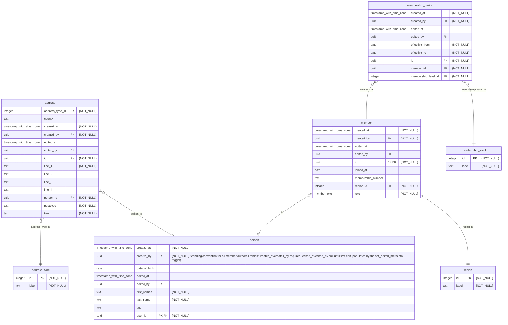

# British Deer Society Mobile App — Database Schema

*Auto-generated from the local Supabase database's actual schema via [mermerd](https://github.com/KarnerTh/mermerd). Do not edit by hand — regenerate after any migration change by running `supabase/scripts/generate-schema-diagram.sh` (requires the local stack to be running: `supabase start`).*

